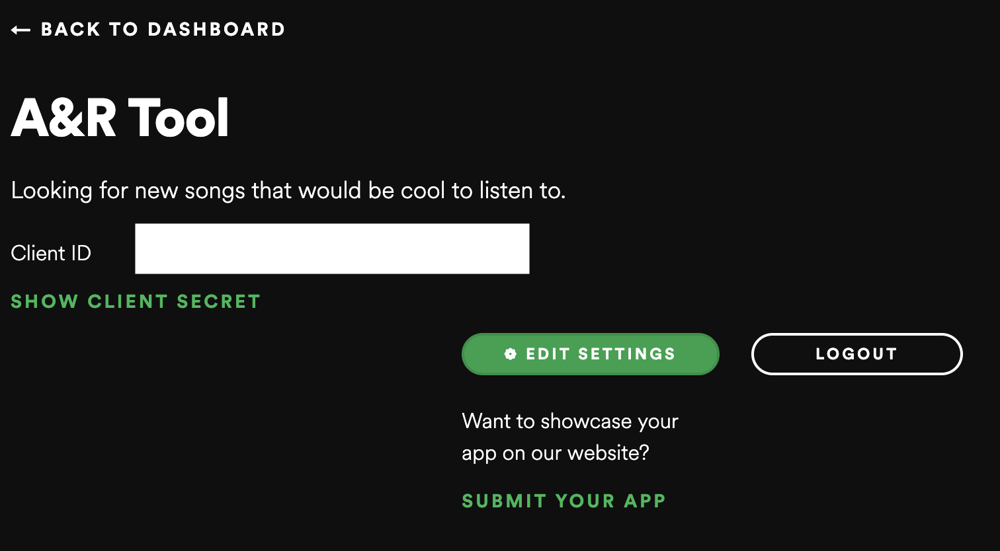
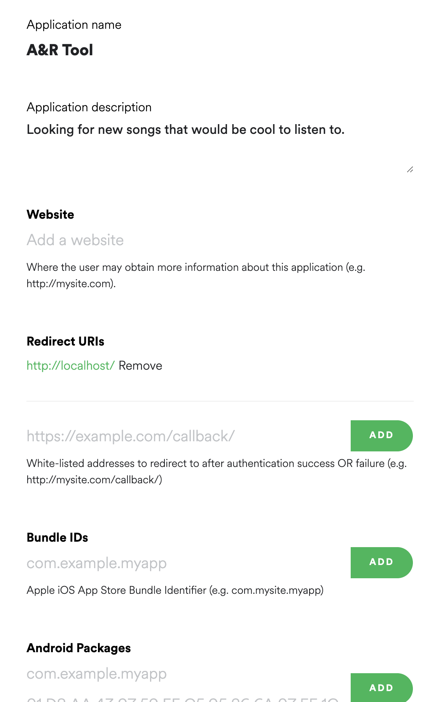

# Elektra Music Group Data Analyst Intern Interview Exercise
This is one of many standard reports created at Elektra Music Group within the A&R department.  The data enclosed within the folder “spotify_top200_viral50_data” contains the regional and viral charts from March 17, 2019 for the countries/regions: Global, Australia, Canada, Ireland, New Zealand, the United Kingdom, and the United States.  Your job will be to take the data and output a standard excel sheet report ranked by basic counting metrics for a popular song.  You will submit your code and the final spreadsheet containing the report.  Organize your code in a way that is easy to follow (clean code, well-documented comments, efficient, etc.) Refer to the final spreadsheet result provided as a reference as you progress throughout the exercise.  

# Instructions

## Part 1
1.  Fork and clone this repo.  You will upload your own private GitHub at the end containing all of this repo's assets in addition to your code, final spreadsheet report, and playlist link (pasted in a README).  

2.  With the "spotify_top200_viral50_data", concatenate all spreadsheets into one consolidated spreadsheet containing every country and genre.  There should be 1750 total rows with the countries and genres listed above.  

3.  Drop the columns: 
    
    `‘Album(s)’, 
    ‘UPC', 
    'Latest Charting Date', 
    'Spotify Track Link', 
    'Spotify Artist Link', 
    'Spotify Album Link',
    'Chart Cycle'`
    
    
4.  Rename the following columns:

    `'Track':'track',
    'ISRC':'isrc',
    'Spotify Track Ids':'track_id',
    'Artist(s)':'artist',
    'Spotify Artist Id(s)':'artist_id',
    'Spotify Album Ids':'album_id',
    'Release Date': 'r_date',
    'Record Label' : 'label',
    'Country':'country',
    'Days on Chart':'days_chart',
    'Chart Type':'chart_type',
    'Peak Position':'peak_pos',
    'Peak Date':'peak_date',
    'Latest Position':'latest_pos',
    'Position Change':'pos_chg',
    'Historical Positions':'hist_pos',`

5.  Ensure the dtype for the `artist` and `track` column is “str”. Some artist and track names are strictly integers.   

6.  Assess all null values.  Fill the `label` column nulls with the str value, “UNKNOWN”.  

7.  Create a `prev_pos` (Previous Position) column that takes the second to last value within the `hist_pos` column. For example, if a track's chart positions are `[5, 4, 6, 3, 2]`, the `prev_pos` value would be 3 (`latest_pos` would be 2). If there is no previous position, enter the `prev_pos` value as the current charting position.  

8.  Create a `pos_chg` (Position Change) column that subtracts `prev_pos` from `latest_pos`.  For example, if a track had a `latest_pos` = 3 and `prev_pos` = 2, the `pos_chg` would be 1.  Tracks that do not have a `prev_pos` value should have a value of 0 for `pos_chg`.

9.  Eliminate all rows that contain either an artist within the "off_limits_artists.xlsx" spreadsheet or the track's label is found in "off_limits_labels.xlsx" spreadsheet located in the "spreadsheet" directory.  Ensure that casing is not considered by *temporarily* lowercasing or uppercasing artist/label names within the dataframe AND the associated Off Limits spreadsheets.  Additionally, use an exact matching filter such as Pandas' "isin" rather than "contains".  There should be 173 rows remaining. 

10.  Create a `freq` (Frequency) column that counts the number of times an ARTIST appears within the dataframe.  You can count either with the `artist` or `artist_id` column.  

11.  Rearrange the columns in the following order:

    `'artist', 
    'track', 
    'r_date', 
    'label', 
    'country', 
    'chart_type',
    'latest_pos',
    'days_chart', 
    'freq', 
    'peak_pos', 
    'peak_date', 
    'pos_chg', 
    'hist_pos',  
    'track_id', 
    'artist_id', 
    'album_id', 
    'isrc'`

# Part 2: Accessing the Spotify API
1. Register a Spotify Web API account and application (this will give you your Client ID and Client Secret). Read the instructions [here](https://developer.spotify.com/documentation/web-api/quick-start/).  You only need to complete the "Set Up Your Account" and ["Register Your Application"](https://developer.spotify.com/documentation/general/guides/app-settings/#register-your-app) steps.  The other steps are not necessary.  The only information you need for creating an application are "Application Name" and "Redirect URI".  A standard redirect URI could be http://localhost/.  If you already have an API Client ID and Client Secret, you can skip this step.  The account setup is free with a premium or free acount. Here is an example.  

2. You will have to authorize your App and User in order to access the Spotify API.  The [Authorization Code](https://developer.spotify.com/documentation/general/guides/authorization-guide/#authorization-code-flow) option provides the correct authorization flow for your work by providing a Refresh Token. It is recommended to create a `state` value and authorize all of your [scopes](https://developer.spotify.com/documentation/general/guides/scopes/). Once you have received your Client ID and Client Secret in addition to authorizing your App/User, you are ready to access Spotify's API. 

3.  Create a scraping script/notebook.  With each [track_id](https://developer.spotify.com/console/get-track/?id=&market=), obtain the track_uri, song popularity score, and release_date.

4.  With each track's [album_id](https://developer.spotify.com/console/get-album/), obtain the track's label/distributor.  

5.  With each track's [artist_id](https://developer.spotify.com/console/get-artist/), obtain the artist's popularity score.  

6.  Replace all values within the dataframe with the newly obtained release_date value, and label value.  

7.  Create new columns: `track_uri`, `sp` (Song Popularity), and `ap` (Artist Popularity) that fills the dataframe with the track_uri values, song popularity values, and artist popularity values. `ap` will be in list form considering some tracks have multiple artists. 

8.  Drop all rows that have songs released prior to 2018-06-01. There should be 35 rows remaining.  

9.  Remove all artists/labels again that appear within the "off_limits_artists.xlsx" and "off_limits_labels.xlsx" spreadsheets located in the "spreadsheet" directory.  There should be 32 rows remaining. 

10.  Sort the dataframe by `latest_pos` ASC, `days_chart` DESC, then `freq` DESC.

11.  Organize the final dataframe by keeping only the first 20 rows.  

12.  Arrange your final columns as so:

    `'artist', 
    'track', 
    'r_date', 
    'label', 
    'sp', 
    'ap', 
    'country', 
    'chart_type',
    'latest_pos',
    'days_chart', 
    'freq', 
    'peak_pos', 
    'peak_date', 
    'pos_chg', 
    'hist_pos', 
    'track_uri'` 

13.  Using the Spotify API, create a playlist with the final 20 track URIs.  

14.  Export the final report as an excel spreadsheet 

15.  Upload your entire repository, titled "firstname_lastname_interview", as a PRIVATE GitHub repository including the "interview_test" original assets in addition to your code, final report, and playlist link (pasted in a README). Make sure to add me (zachcox-elektra) as a collaborator. If working in Jupyter Notebooks, have the output of your code displayed.  I should be able to fork + clone the repo and have the code run on my computer without reformatting anything.  Email GitHub link to zachcox@elektra.com
